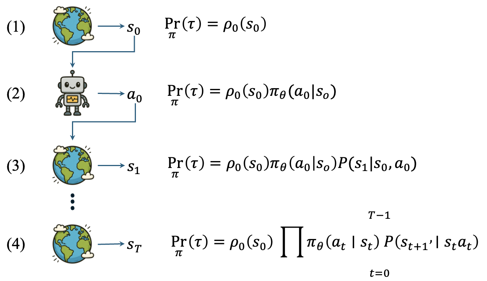

+++
date = '2025-10-11T16:57:22+08:00'
draft = false
title = 'Policy Gradient 算法'
+++

<!--more-->

## 策略参数化

回顾状态价值相关部分，我们知道“最大化长期回报”这条主线贯穿绝大多数强化学习问题，通常用 $J(\pi)$ 表示，如式 $\text{(1)}$ 。

```python
import sys

a =
```

$$
\tag{1}
J(\pi)=\mathbb{E}_{s_{0} \sim \rho_{0}} \left[V^{\pi}\left(s_{0}\right)\right]
$$

其中 $\rho_{0}$ 是初始状态分布，$V^{\pi}(s)$ 是状态价值。状态价值指从状态 $s$ 开始，智能体在策略 $\pi$ 指导下所能获得的未来（折扣）回报的期望，定义如式 $\text{(2)}$ 所示。

$$
\tag{2}
V^{\pi}(s)=\mathbb{E}_{\pi}\left[\sum_{t=0}^{\infty} \gamma^{t} r_{t} \mid s_{0}=s\right]
$$

其中 $r_{t}$ 是第 $t$ 步的即时奖励， $\gamma \in[0,1)$ 是折扣因子，折扣因子越大表示更看重近期的奖励。

为解决控制问题（见预测与控制部分），需要引入动作价值函数，定义如式 $\text{(3)}$ 所示。

$$
\tag{3}
Q^{\pi}(s, a)=\mathbb{E}_{\pi}\left[\sum_{t=0}^{\infty} \gamma^{t} r_{t} \mid s_{0}=s, a_{0}=a\right]
$$

这样一来，状态价值就可以通过动作价值函数表示，如式 $\text{(4)}$ 所示。

$$
\tag{4}
V^{\pi}(s)=\mathbb{E}_{a \sim \pi(a|s)}\left[Q^{\pi}(s, a)\right] = \sum_{a} \pi(a|s) Q^{\pi}(s, a)
$$

从式 $\text{(4)}$ 可以看出，想要最大化目标函数 $J(\pi)$ ， 可以从两个方面入手：一是基于动作价值函数 $Q^{\pi}(s, a)$ ， 即基于价值的方法；二是直接优化策略 $\pi(a|s)$ ，即基于策略的方法。

在基于价值的算法中（例如 $DQN$ ）， 通常是将动作价值即 $Q^{\pi}(s, a)$ 函数参数化为 $Q_\theta(s, a)$ <sup>①</sup> ，然后通过最大化动作价值函数来选择动作，如式 $\text{(5)}$ 所示。

$$
\tag{5}
a^{*}=\underset{a}{\arg \max } Q_{\theta}(s, a)
$$

> ② 有时也写作 $Q(s, a; \theta)$，表示 $Q$ 函数是关于 $s, a$ 的函数，参数为 $\theta$ 。

换句话说，在基于价值的算法中，策略 $\pi$ 其实是隐含在动作价值函数 $Q_{\theta}(s, a)$ 中的，根据式 $\text{(5)}$ 可知，策略 $\pi$ 是一个确定性策略（ $\text{deterministic policy}$ ），即在状态 $s$ 下总是选择同一个动作 $a^{*}$。也就是说，当 $Q_{\theta}(s, a)$ 函数被准确地估计出来并逼近最优解 $Q^{*}(s, a)$ 时，相应的策略 $\pi$ 也就逼近了最优策略 $\pi^{*}$ ， 进而使长期回报即 $J(\pi)$ 最大化。 为求解 $Q_{\theta}(s, a)$ 函数，通常使用时序差分（ $\text{Temporal Difference, TD}$ ）方法， 即通过最小化时序差分目标与当前估计值之间的误差来并结合梯度下降方法更新参数 $\theta$ ，如式 $\text{(6)}$ 所示。

$$
\tag{6}
\begin{aligned}
\theta \leftarrow \theta-\alpha \nabla_{\theta} L(\theta) \\
L(\theta)=\mathbb{E}_{s, a, r, s^{\prime} \sim \mathcal{D}}\left[\left(r+\gamma \max _{a^{\prime}} Q_{\theta}\left(s^{\prime}, a^{\prime}\right)-Q_{\theta}(s, a)\right)^{2}\right]
\end{aligned}
$$

其中 $\alpha$ 是学习率， $\mathcal{D}$ 是经验回放（ $\text{Experience Replay Buffer}$ ），存储了智能体与环境交互过程中产生的状态 $s$ 、动作 $a$ 、奖励 $r$ 和下一个状态 $s^{\prime}$ 等信息。

而本节要讲的 **策略梯度**（ $\text{Policy Gradient, PG}$ ）方法，是直接将策略 $\pi$ 参数化为 $\pi_\theta(a|s)$ ，然后通过最大化目标函数 $J(\pi_\theta)$ 来优化参数 $\theta$ ，从而使得策略 $\pi_\theta$ 逐步逼近最优策略 $\pi^{*}$ 。

## 目标函数推导一

### 轨迹概率密度

怎么求解目标函数 $J(\pi_\theta)$ 呢？其实是可以通过计算轨迹产生的概率来求解的，下面将逐步展开说明。

我们知道智能体与环境交互过程中，首先环境会返回一个初始状态 $s_0$ , 然后智能体观测到当前状态并执行动作 $a_0$ 。与此同时，环境会反馈一个奖励 $r_0$，并返回下一个状态 $s_1$，智能体再相应地执行动作 $a_1$，环境返回奖励 $r_1$ 和下一个状态 $s_2$，如此反复进行下去，直至终止状态 $s_T$ 。注意，这里通常假设是有终止状态的，即有限马尔可夫决策过程（ $\text{Finite MDP}$ ）。

这样完整的有限步数的交互过程，称为一个 **回合**（ $\text{episode}$ ），回合最大步数用 $T$ 表示 (也叫作 $\text{Horizon}$ <sup>②</sup>)。把所有状态、动作和奖励组合起来的一个序列，称为 **轨迹**（ $\text{trajectory}$ ），如式 $\text{(7)}$ 所示。

$$
\tag{7}
\tau=\left\{s_{0}, a_{0}, r_{0}, s_{1}, a_{1}, r_{1}, \cdots, s_{T}, a_{T}, r_{T}\right\}
$$

> ② 参考自CS234，该词出现频率不算高，了解即可

为了计算轨迹产生的概率，我们可以先具体展开轨迹产生的路径。如图 1 所示，首先环境会从初始状态分布中采样出一个初始状态 $s_0$ ，对应的概率为 $\rho_0(s_0)$ 。然后智能体在状态 $s_0$ 下根据策略 $\pi_\theta(a|s)$ 采样出一个动作 $a_0$ ，对应的概率为 $\pi_\theta(a_0|s_0)$ ，接着环境根据状态转移概率 $P(s^{\prime}|s, a)$ 采样出下一个状态 $s_1$ ，对应的概率为 $P(s_1|s_0, a_0)$ 。此时对应的轨迹序列为 $\tau = \{s_0, a_0, s_1\}$ ，根据条件概率可知，该轨迹产生的概率为 $\Pr(\tau) = \rho_0(s_0) \pi_\theta(a_0|s_0) P(s_1|s_0, a_0)$ 。 

<div align=center>

<figcaption>图 1 轨迹概率的计算</figcaption>
</div>

以此类推，可得完整轨迹的概率计算如式 $\text{(8)}$ 所示。

$$
\tag{8}
\Pr_{\pi}(\tau) = \rho_0(s_0) \prod_{t=0}^{T-1} \pi_\theta(a_t|s_t) P(s_{t+1}|s_t, a_t)
$$

可以看出，轨迹概率确实可以写成关于策略 $\pi_\theta(a|s)$ 或者策略参数 $\theta$ 的函数，如式 $\text{(9)}$ 所示。

$$
\tag{9}
\Pr_{\pi}(\tau) = p_\theta(\tau)
$$

给定策略 $\pi_\theta$ ，产生的轨迹可能会有很多种，因此对于式 $\text{(9)}$ 更准确的表述是轨迹概率的分布，即轨迹概率密度。记每条的轨迹对应的回报为 $R(\tau)$ ，根据全概率公式可知，目标函数 $J(\pi_\theta)$ 可以表示为轨迹概率密度与对应回报的乘积在所有轨迹上的积分，如式 $\text{(10)}$ 所示。

$$
\tag{10}
J(\pi_\theta)=\int_{\tau} p_\theta(\tau) R(\tau) d \tau = \mathbb{E}_{\tau \sim p_\theta(\tau)}[R(\tau)]
$$

### 对数导数技巧

为了最大化目标函数 $J(\pi_\theta)$ ，可以使用梯度上升法，即通过计算目标函数关于参数 $\theta$ 的梯度 $\nabla_\theta J(\pi_\theta)$ 来更新参数 $\theta$ ，如式 $\text{(11)}$ 所示。

$$
\tag{11}
\theta \leftarrow \theta + \alpha \nabla_\theta J(\pi_\theta)
$$

实际运用中为了方便，会将梯度上升法转化为梯度下降法，即通过最小化目标函数的负值来更新参数 $\theta$ ，如式 $\text{(12)}$ 所示。

$$
\tag{12}
\theta \leftarrow \theta - \alpha \nabla_\theta (-J(\pi_\theta))
$$

但无论哪种方式，关键都是要计算梯度 $\nabla_\theta J(\pi_\theta)$ 。根据式 $\text{(10)}$ 可知，梯度 $\nabla_\theta J(\pi_\theta)$ 的计算如式 $\text{(13)}$ 所示。
$$
\tag{13}
\nabla_\theta J(\pi_\theta) = \nabla_\theta \int_{\tau} p_\theta(\tau) R(\tau) d \tau = \int_{\tau} \nabla_\theta p_\theta(\tau) R(\tau) d \tau
$$

其中 $R(\tau)$ 一般不会是参数 $\theta$ 的函数，因此可以直接提到积分号外面。接下来，关键是要计算 $\nabla_\theta p_\theta(\tau)$ 。然而，根据式 $\text{(9)}$ 可知，轨迹概率密度 $p_\theta(\tau)$ 是一个连乘积项，直接对其求导会比较复杂。为此，可以使用 **对数导数技巧**（ $\text{log-derivative trick}$ ）来简化计算过程。该技巧的核心思想是通过对数函数的链式法则来将导数从概率密度函数 $p_\theta(\tau)$ 转移到对数概率密度函数 $\log p_\theta(\tau)$ 上，从而简化计算。具体来说，利用对数函数的导数性质，有式 $\text{(14)}$ 。

$$\tag{14}
\nabla_\theta \log p_\theta(\tau) = \frac{\nabla_\theta p_\theta(\tau)}{p_\theta(\tau)} \implies \nabla_\theta p_\theta(\tau) = p_\theta(\tau) \nabla_\theta \log p_\theta(\tau)
$$
将式 $\text{(14)}$ 代入式 $\text{(13)}$ 中，可得梯度 $\nabla_\theta J(\pi_\theta)$ 的计算如式 $\text{(15)}$ 所示。
$$
\tag{15}
\nabla_\theta J(\pi_\theta) = \int_{\tau} p_\theta
(\tau) \nabla_\theta \log p_\theta(\tau) R(\tau) d \tau = \mathbb{E}_{\tau \sim p_\theta(\tau)}[\nabla_\theta \log p_\theta(\tau) R(\tau)]
$$

根据式 $\text{(8)}$ 可知，轨迹概率密度 $p_\theta(\tau)$ 中唯一与参数 $\theta$ 相关的项是策略 $\pi_\theta(a|s)$ ，因此可以将对数概率密度函数 $\log p_\theta(\tau)$ 展开，如式 $\text{(16)}$ 所示。

$$
\tag{16}
\log p_\theta(\tau) = \sum_{t=0}^{T-1} \log \pi_\theta(a_t|s_t) + \log P(s_{t+1}|s_t, a_t)
$$
由于环境的状态转移概率 $P(s^{\prime}|s, a)$ 与参数 $\theta$ 无关，因此对其求导结果为零，即 $\nabla_\theta \log P(s_{t+1}|s_t, a_t) = 0$ 。这样一来，式 $\text{(16)}$ 可简化为式 $\text{(17)}$ 所示。
$$
\tag{17}
\log p_\theta(\tau) = \sum_{t=0}^{T-1} \
log \pi_\theta(a_t|s_t)
$$
将式 $\text{(17)}$ 代入式 $\text{(15)}$ 中，可得梯度 $\nabla_\theta J(\pi_\theta)$ 的计算如式 $\text{(18)}$ 所示。
$$
\tag{18}
\nabla_\theta J(\pi_\theta) = \mathbb{E}_{\tau \sim p_\theta(\tau)}\left[\left(\sum_{t=0}^{T-1
} \nabla_\theta \log \pi_\theta(a_t|s_t)\right) R(\tau)\right]
$$


其中回报 $R(\tau)$ 的表示方式实际上可以有多种选择，最简单的表示是轨迹中所有步数奖励的和，如式 $\text{(19)}$ 所示。

$$
\tag{19}
R(\tau) = \sum_{t=0}^{T-1} r_t
$$

将式 $\text{(19)}$ 代入式 $\text{(18)}$ 中，并交换求和次序，可得梯度 $\nabla_\theta J(\pi_\theta)$ 的计算如式 $\text{(20)}$ 所示。

$$
\tag{20}
\nabla_\theta J(\pi_\theta) = \mathbb{E}_{\tau \sim p_\theta(\tau)}\left[\sum_{t=0}^{T-1} \nabla_\theta \log \pi_\theta(a_t|s_t) \sum_{t=0}^{T-1} r_{t}\right]
$$

或者等价形式（折扣情形）

$$
J(\pi)= \frac{1}{1-\gamma}\mathbb{E}_{s \sim d^{\pi}(s), a \sim \pi(a|s)} [r(s, a)]
$$
